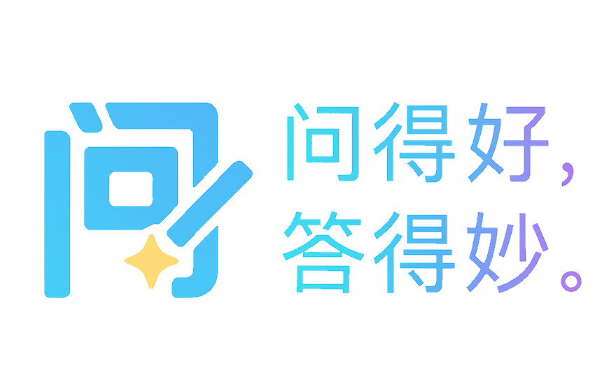
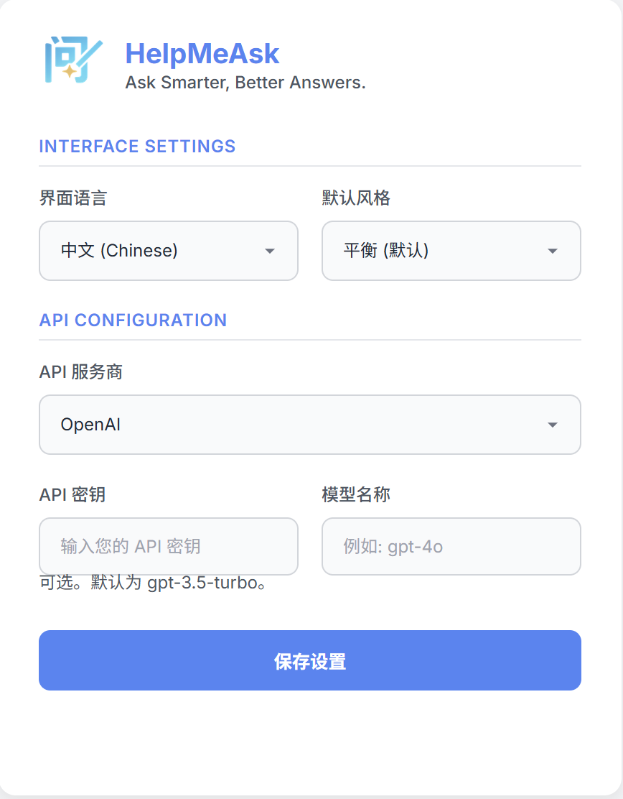
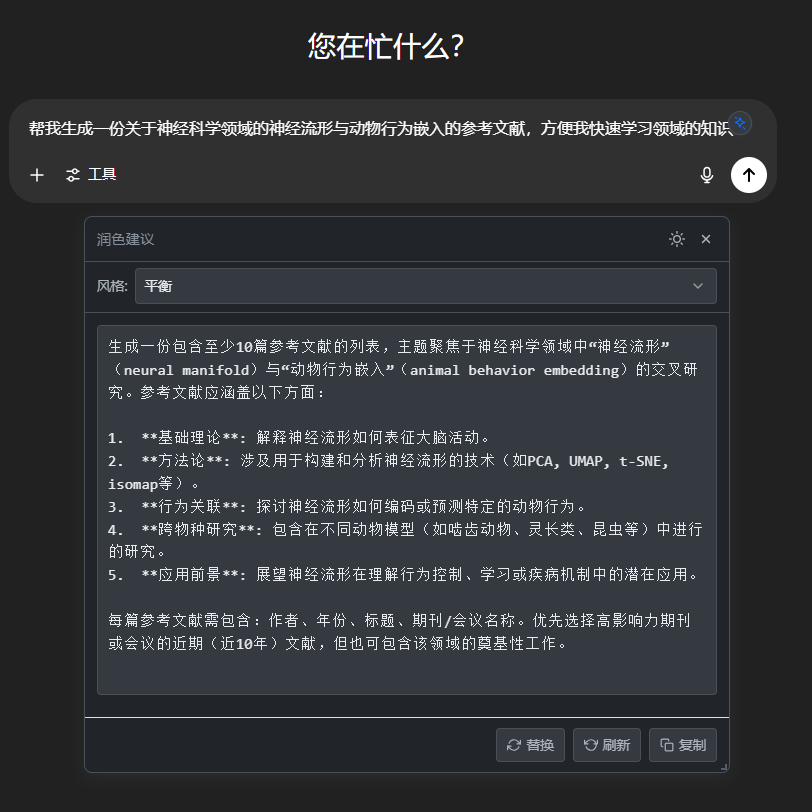
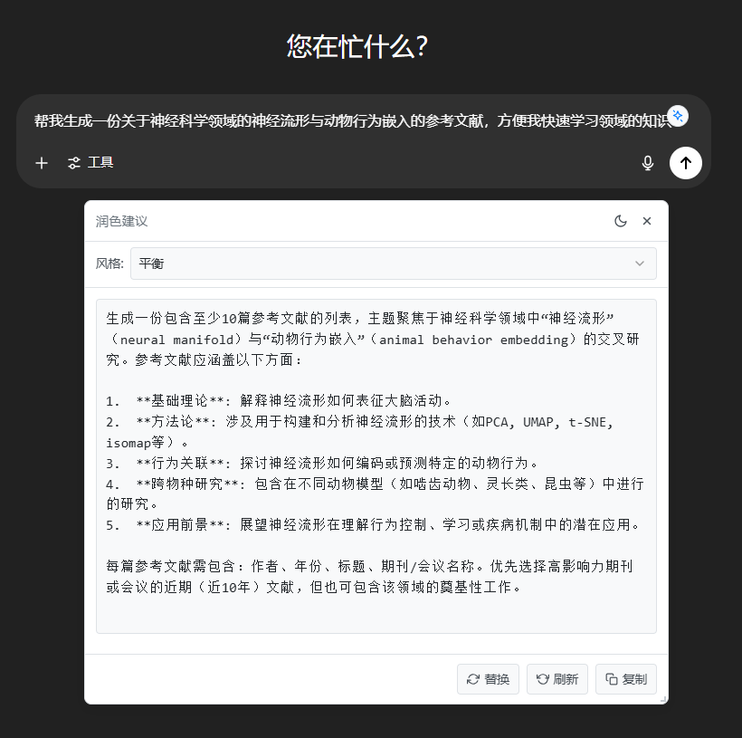

# HelpMeAsk ✨🗣️
**Ask Smarter, Better Answers.**

**问得好，答得妙。**

[English Version](./README_en.md)



**HelpMeAsk** 是一款轻巧的浏览器扩展程序，旨在帮助您在将问题发送给 ChatGPT、Gemini、Claude、DeepSeek、豆包等AI平台之前，优化和润色您的问题。即时获得更清晰、更有效的问题，解锁更高质量的AI回答。

---

## 🚀 主要功能

- 💡 **智能浮现：** 自动出现在AI聊天输入框附近。
- ✍️ **一键优化：** 将您的输入重写为更适合AI理解和回答的有效问题。
- ✨ **多种风格：** 提供多种优化风格（如平衡、创意、简洁、编程模式），满足不同场景需求。
- 🌐 **广泛兼容：** 支持 ChatGPT、Gemini、Claude、Poe、豆包、DeepSeek 等主流AI平台。
- ⚡ **实时高效：** 只需一键点击，即可优化您的问题。
- 🎨 **主题切换：** 支持浅色和深色模式。
- ⌨️ **快捷操作：** 使用 `Alt+P` (Mac上为 `Option+P`) 快速唤起。
- 🧩 **轻量安全：** 无后台追踪，不收集用户数据。所有处理均在本地或通过您选择的API完成。(对于免费的API，建议使用OpenRouter)
- 🌍 **多语言界面：** 目前支持英文和中文。

---

## 📸 截图与演示


<div style="text-align:center;">
    
  
  
</div>


---

### 示例1：理解复杂概念

#### 1. 🤔 用户的原始问题：
> “给我讲讲量子计算。”

#### 2. 💡 LLM优化后的问题 (均衡风格):
> “我是一名学生，对经典计算有基础的了解。请为我解释一下量子计算的概念。请为初学者组织你的解释，并涵盖以下几个关键点：
> 1.  什么是量子比特（qubit）？它与经典比特有何不同？
> 2.  请用简单的类比来解释叠加态和纠缠态的原理。
> 3.  在哪些潜在应用上，量子计算能超越经典计算？
> 4.  目前量子计算机的发展面临哪些主要挑战？”


---


### 示例2：学习一项新技能
#### 1. 🤔 用户的原始问题：
>“怎么入门Photoshop？”

#### 2. 💡 LLM优化后的问题 (均衡风格):
>“我是一个完全没有平面设计经验的初学者，想要学习Photoshop。我的主要目标是能够编辑我的个人照片（色彩校正、移除物体）和为社交媒体制作简单的图形。
>
>请为我提供一个为期30天的结构化学习计划。请按周进行分解，包括：
>
>第一周：需要重点关注的核心概念和基本工具。
第二周：基础的照片编辑技术。
第三周：图层和蒙版的入门。
第四周：创建简单的社交媒体图形并结合所学技能。
对于每一周，请推荐一到两个具体的、适合初学者的免费在线教程（YouTube视频或文章）。”

---

## 🛠 安装指南

1.  **从 Chrome 应用商店 / Edge 加载项商店安装：**
    * [Chrome 应用商店链接] (即将上线!)
    * [Edge 加载项商店链接] (即将上线!)

2.  **或，手动安装：**
    * 下载或克隆此仓库：
        ```bash
        git clone https://github.com/HughYau/HelpMeAsk.git
        ```
    * 打开您的浏览器 (Chrome/Edge/Brave)。
    * 访问 `chrome://extensions/` (适用于 Chrome/Brave) 或 `edge://extensions/` (适用于 Edge)。
    * 启用 **开发者模式** (通常在页面右上角的开关)。
    * 点击 **“加载已解压的扩展程序”**，然后选择您克隆/下载的扩展文件所在文件夹 (`HelpMeAsk` 文件夹)。
    * 完成! ✅ 您应该能在浏览器的工具栏中看到 HelpMeAsk 图标。

---

## 💡 工作原理

1.  **配置 API (仅首次使用需要)：**
    * 点击浏览器工具栏中的 HelpMeAsk 图标，打开设置面板。
    * 选择您偏好的 AI 服务商 (例如 OpenAI, DeepSeek, OpenRouter)。
    * 输入您在该服务商的 API 密钥。
    * 如果需要 (特别是对于 OpenRouter)，可以指定模型名称。
    * 选择您偏好的界面语言和默认优化风格。
    * 点击“保存设置”。

2.  **使用 HelpMeAsk：**
    * 访问 ChatGPT, Gemini, Poe, 豆包或任何其他支持的 AI 聊天界面。
    * 在聊天输入框中开始输入您的问题或想讨论的主题。
    * HelpMeAsk ✨ 按钮会自动出现在输入框附近。
    * 点击 ✨ 按钮 (或按下 `Alt+P`/`Option+P` 快捷键)。
    * 一个弹窗会出现，展示经过优化的新问题版本。
    * 您可以：
        * 选择不同的 **优化风格**。
        * **复制** 优化后的问题。
        * 用优化后的问题 **替换** 输入框中的原文。
        * **重新生成** 另一个优化版本。
    * 将优化后的问题发送给AI，获得更棒的回复！

---

## ⚙️ 支持平台 (持续扩展中)

* ChatGPT
* Gemini
* Claude
* Poe
* 豆包 (Doubao)
* DeepSeek
* 更多平台敬请期待！

---

## 🔒 隐私保护

**HelpMeAsk 尊重您的隐私。**

* 本扩展程序 **不会** 收集或传输您的任何个人数据或聊天内容。
* 当您使用优化功能时，您的原始文本会 **直接从您的浏览器发送到您在设置中选择的AI API服务商**（例如OpenAI、Anthropic等）。HelpMeAsk 仅作为格式化请求的中间层，**不会存储您的提问或AI的回复**。
* 您的 API 密钥会安全地存储在您浏览器的同步存储空间中，并且仅用于与您配置的相应AI服务商进行通信。

---

## ⭐️ Star 本项目

如果您觉得 HelpMeAsk 对您有帮助，请在 GitHub 上给它一个 ⭐️！这能帮助更多人发现这个项目，也是对我持续开发的最大鼓励。谢谢！
