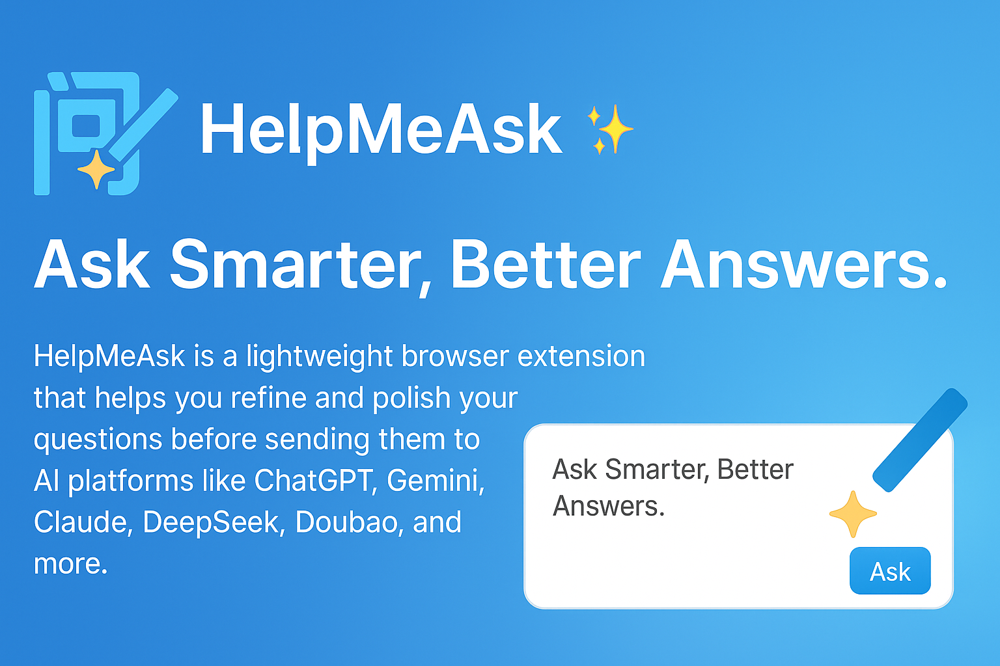
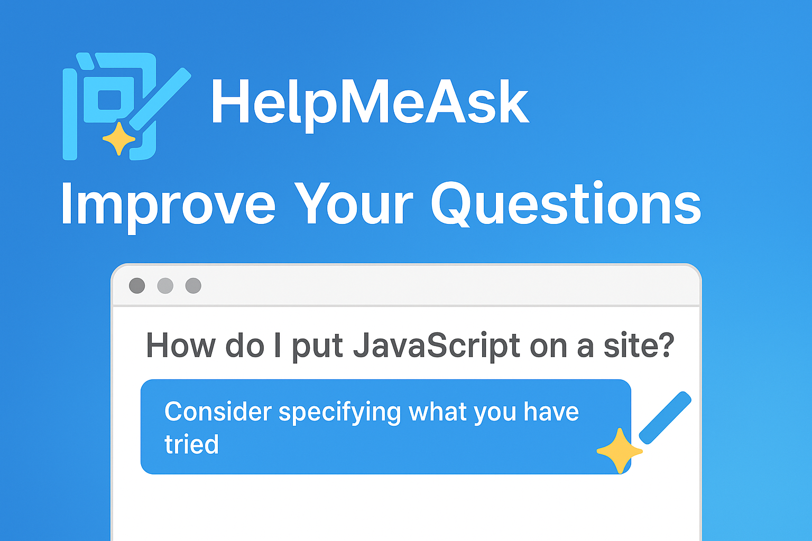
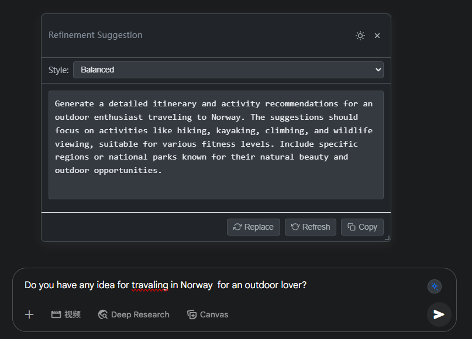
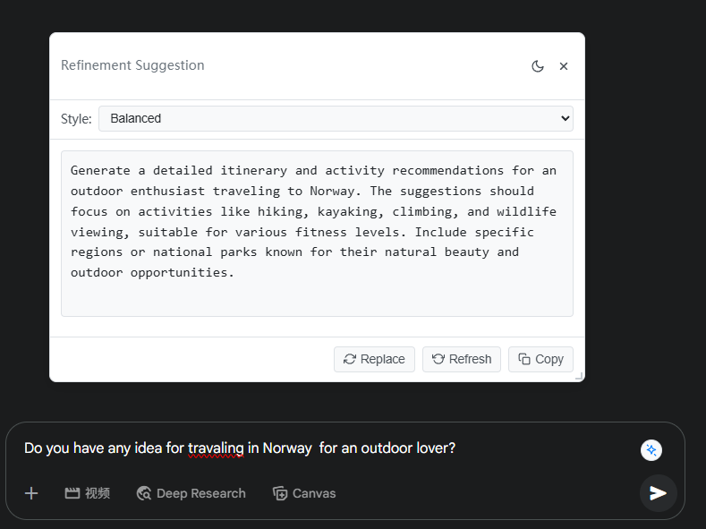

# HelpMeAsk ✨🗣️

**Ask Smarter, Better Answers.**

[简体中文](./README.md)

<div align="center">
  
</div>

**HelpMeAsk** is a lightweight browser extension that helps you refine and polish your questions before sending them to AI platforms like ChatGPT, Gemini, Claude, DeepSeek, Doubao, and more. Get clearer, more effective questions — instantly — and unlock better AI responses.

---

## 🚀 Features

- 💡 **Smart Suggestions:** Automatically appears near AI chat input boxes.
- ✍️ **One-Click Refinement:** Rewrites your input into a more effective question for AI.
- ✨ **Multiple Styles:** Choose different refinement styles (e.g., balanced, creative, concise, programming) to suit your needs.
- 🌐 **Broad Compatibility:** Works with ChatGPT, Gemini, Claude, Poe, Doubao, DeepSeek, and other popular AI platforms.
- ⚡ **Real-Time Efficiency:** Enhances your questions with just one click.
- 🎨 **Customizable Theme:** Light and dark mode available.
- ⌨️ **Keyboard Shortcut:** Use `Alt+P` (or `Option+P` on Mac) for quick access.
- 🧩 **Lightweight & Private:** No background tracking or data collection. All processing is done locally or via your chosen API. (for free one, check this: [https://github.com/cheahjs/free-llm-api-resources](https://github.com/cheahjs/free-llm-api-resources). OpenRouter is supported)
- 🌍 **Multilingual Interface:** Supports English and Chinese.
  
<div align="center">
  
</div>

---

## 📸 Screenshots & Demo

<div style="text-align:center;">
    
  
  
</div>

---

### Example 1: Understanding Complex Concepts

#### 1. 🤔 User's Original Question:
> "Tell me about quantum computing."

#### 2. 💡 LLM-Refined Question (Balanced Style):
> "I am a university student with a basic understanding of classical computing. Please explain the concept of quantum computing. Structure your explanation for a beginner, covering these key points:
> 1.  What is a qubit and how does it differ from a classical bit?
> 2.  Explain the principles of superposition and entanglement using simple analogies.
> 3.  What are some potential applications where quantum computing could excel over classical computing?
> 4.  What are the major challenges currently facing the development of quantum computers?"

#### 3. 🚀 AI's Answer to the Refined Question:
<details>
<summary><em>Click to see AI's detailed answer to the refined question</em></summary>

Great! Here's a beginner-friendly explanation of quantum computing, structured around the four key points you asked about:

---

### 1. **What is a qubit and how does it differ from a classical bit?**

In **classical computing**, everything is built on *bits*. A bit is the smallest unit of information and can be either a `0` or a `1`.

In **quantum computing**, the basic unit is a **qubit** (quantum bit). Unlike a classical bit that can be only in one state (`0` or `1`) at a time, a **qubit can be in a combination of both `0` and `1` at the same time**. This is called **superposition** (more on that next).

Think of a classical bit as a light switch: it's either off (0) or on (1). A qubit is more like a dimmer light switch that can be in any mixture of off and on, until you measure it — then it "snaps" to 0 or 1.

---

### 2. **Explain the principles of superposition and entanglement using simple analogies**

#### 🌀 **Superposition**:

Imagine you're spinning a coin in the air. While it's spinning, it's not just heads or tails — it's *both* in a way. Only when it lands (you measure it), does it become one or the other.

In the same way, a qubit in superposition can hold both `0` and `1` simultaneously. This allows quantum computers to explore many possible solutions at once, rather than one by one like classical computers.

#### 🔗 **Entanglement**:

Now suppose you have two magic coins. If one lands on heads, the other *always* lands on tails, no matter how far apart they are — even if one is in Denmark and the other is on the Moon. That’s **entanglement**.

In quantum computing, **entangled qubits are linked** so that the state of one instantly affects the state of the other. This property allows quantum computers to perform certain operations much faster and in a more connected way than classical ones.

---

### 3. **What are some potential applications where quantum computing could excel over classical computing?**

Quantum computers won’t replace classical computers for most everyday tasks — but they could revolutionize specific fields:

* **Cryptography**: Quantum computers can potentially break current encryption methods, which rely on problems that classical computers can’t easily solve (like factoring large numbers).
* **Drug discovery**: Quantum systems can simulate molecules and chemical reactions much more precisely, speeding up the development of new medicines.
* **Optimization problems**: Logistics, supply chains, and financial modeling could benefit from quantum computers finding the best solution among many possibilities.
* **Materials science**: Designing new materials at the atomic level (e.g., superconductors, batteries) could become much more efficient.
* **Artificial Intelligence**: Some quantum algorithms could accelerate parts of machine learning, like training models or exploring large datasets.

---

### 4. **What are the major challenges currently facing the development of quantum computers?**

Despite the promise, building a useful quantum computer is *extremely difficult*. Here’s why:

* **Qubit stability (Decoherence)**: Qubits are very fragile. Any small disturbance (heat, vibration, magnetic field) can collapse their quantum state, destroying the information.
* **Error correction**: Quantum operations are error-prone. We need special techniques (quantum error correction) to fix them, which require *lots* of extra qubits.
* **Scalability**: Today’s quantum computers have tens to hundreds of qubits. For many practical applications, we’ll need thousands or even millions.
* **Hardware**: Qubits often require extreme conditions to operate (e.g., near absolute zero temperatures), which makes quantum hardware very expensive and complex.
* **Software and algorithms**: We're still learning how to write efficient quantum algorithms. Most applications are theoretical or experimental at this stage.

---

### Summary

| Classical Bit | Quantum Qubit                 |
| ------------- | ----------------------------- |
| 0 or 1        | 0, 1, or both (superposition) |
| Independent   | Can be entangled with others  |

Quantum computing offers a fundamentally different way of processing information, leveraging **superposition** and **entanglement** to potentially solve problems classical computers can’t — but it's still in its early stages due to major **technical and theoretical challenges**.

Would you like a visual diagram or further reading suggestions on any of these topics?

</details>


---


### Example 2: Learning a New Skill
#### 1. 🤔 User's Original Question:
>"How do I learn Photoshop?"

#### 2. 💡 LLM-Refined Question (Balanced Style):
>"I am a complete beginner with no prior experience in graphic design, and I want to learn Photoshop. My main goal is to be able to edit my personal photos (color correction, removing objects) and create simple graphics for social media.
>
>Please provide a structured learning plan for the first 30 days. Break it down week by week, including:
>
>Week 1: Core concepts and essential tools to focus on.
Week 2: Basic photo editing techniques.
Week 3: Introduction to layers and masks.
Week 4: Creating simple social media graphics and combining skills.
For each week, please suggest one or two specific and free online tutorials (YouTube videos or articles) that are great for beginners."

#### 3. 🚀 AI's Answer to the Refined Question:
<details>
<summary><em>Click to see AI's detailed answer to the refined question</em></summary>

Absolutely! Here's a structured 30-day beginner-friendly Photoshop learning plan tailored to your goals: photo editing (color correction, object removal) and creating simple social media graphics. Each week builds on the previous one, with curated free tutorials to guide you.

---

## 🗓️ Week 1: Core Concepts & Essential Tools

**Focus:** Get comfortable with Photoshop’s interface and foundational tools.

### ✅ Key Concepts:

* Understanding the workspace: toolbar, panels, menus
* Using selection tools: Marquee, Lasso, Quick Selection
* Basic tools: Move Tool, Crop Tool, Brush Tool, Eraser
* Saving and exporting images([phlearn.com][1])

### 🎓 Tutorials:

1. **Photoshop for Complete Beginners | Lesson 1**
   A comprehensive introduction to Photoshop's interface and basic tools.
   [Watch on YouTube](https://www.youtube.com/watch?v=xTzvQkOll2U)

2. **Photoshop for Beginners | FREE COURSE**
   A free course covering the basics of Photoshop for beginners.
   [Watch on YouTube](https://www.youtube.com/watch?v=IyR_uYsRdPs)

---

## 🗓️ Week 2: Basic Photo Editing Techniques

**Focus:** Learn essential photo editing skills like color correction and object removal.

### ✅ Key Techniques:

* Adjusting brightness, contrast, and saturation
* Using Levels and Curves for tonal adjustments
* Removing blemishes with the Spot Healing Brush
* Removing objects using the Clone Stamp Tool([proedu.com][2], [proedu.com][3], [en.wikipedia.org][4])

### 🎓 Tutorials:

1. **Photoshop Basics: Everything You Need to Know to Edit Photos**
   Covers fundamental photo editing techniques in Photoshop.
   [Watch on YouTube](https://www.youtube.com/watch?v=fsd2NUfJkNw)

2. **Basic Photo Editing: 10 Steps**
   A step-by-step guide to basic photo editing techniques.
   [Read on Instructables](https://www.instructables.com/basic-photo-editing/)

---

## 🗓️ Week 3: Introduction to Layers & Masks

**Focus:** Understand how to use layers and masks for non-destructive editing.

### ✅ Key Concepts:

* Working with layers: creating, organizing, and blending
* Using layer masks for selective editing
* Applying adjustment layers
* Combining images using masks([proedu.com][2], [theschoolofphotography.com][5])

### 🎓 Tutorials:

1. **Master Photoshop Layer Masks | Step-By-Step Tutorial**
   A detailed guide on using layer masks in Photoshop.
   [Watch on YouTube](https://www.youtube.com/watch?v=1HOQQLcEH4g)

2. **Layer Masks & Collages | Free Photoshop Tutorial**
   Learn how to create collages using layer masks.
   [Read on Noble Desktop](https://www.nobledesktop.com/learn/photoshop/layer-masks-collages)

---

## 🗓️ Week 4: Creating Simple Social Media Graphics

**Focus:** Apply your skills to design engaging social media graphics.

### ✅ Key Skills:

* Setting up documents with correct dimensions for platforms like Instagram and Facebook
* Adding and styling text
* Incorporating shapes and icons
* Exporting graphics optimized for web([creativemarket.com][6], [graphicdesign.stackexchange.com][7], [phlearn.com][8])

### 🎓 Tutorials:

1. **Quick Social Media Graphics in Photoshop | Beginner's Tutorial**
   Learn to create social media graphics quickly and efficiently.
   [Watch on YouTube](https://www.youtube.com/watch?v=pbQYHdPuFrs)

2. **Add Fun Graphics to a Social Media Image**
   A tutorial on enhancing social media images with graphics.
   [Read on Adobe Help Center](https://helpx.adobe.com/photoshop/how-to/create-social-media-graphics.html)

---

## 🧠 Tips for Success:

* **Practice Daily:** Even 15–30 minutes a day can lead to significant improvement.
* **Use Your Own Photos:** Applying techniques to your images makes learning more relevant.
* **Experiment:** Don't be afraid to try new tools and settings to see what they do.
* **Stay Organized:** Keep your layers and files organized to make editing easier.([en.wikipedia.org][9])

Feel free to ask if you need further guidance or have specific questions as you progress!

[1]: https://phlearn.com/photoshop-tutorials/?utm_source=chatgpt.com "600+ Free Photoshop Tutorials - Learn Photoshop Online - Phlearn"
[2]: https://proedu.com/blogs/photoshop-skills/photoshop-tutorials-photo-editing-essential-techniques-for-beginners?srsltid=AfmBOoq94LUuivmYOvlrzS1Gq1tTCqB0sbA-yp9R4DPz3mZK0K5zDoSj&utm_source=chatgpt.com "Photoshop Editing: Beginner's Essential Guide - PRO EDU"
[3]: https://proedu.com/blogs/photoshop-skills/photoshop-tutorials-for-beginners-free-essential-skills-to-master-in-2025?srsltid=AfmBOoq9nvnRvk7Xp5OslSqccd94DL9raNCwGPQjg-cNkjUDOXQoT1Vn&utm_source=chatgpt.com "Free Photoshop Tutorials for Beginners 2025 - PRO EDU"
[4]: https://en.wikipedia.org/wiki/Photopea?utm_source=chatgpt.com "Photopea"
[5]: https://www.theschoolofphotography.com/tutorials/layers-in-photoshop?srsltid=AfmBOooinnJRIS1kuWs8pp-TeoG-Nxjk0RMPrTN8nc6SuJKupjdQzagO&utm_source=chatgpt.com "Layers in Photoshop – Ultimate Guide for Beginners"
[6]: https://creativemarket.com/blog/social-media-graphics-photoshop?utm_source=chatgpt.com "How to Design Stunning Social Media Graphics With Photoshop"
[7]: https://graphicdesign.stackexchange.com/questions/38640/how-to-mask-a-layer-with-shapes-in-photoshop?utm_source=chatgpt.com "How to mask a layer with shapes in photoshop?"
[8]: https://phlearn.com/tutorial/graphics-logos-photoshop/?utm_source=chatgpt.com "How to Create Graphics & Logos in Photoshop - PHLEARN"
[9]: https://en.wikipedia.org/wiki/Scott_Kelby?utm_source=chatgpt.com "Scott Kelby"

</details>

---

## 🛠 Installation

1.  **Install from Chrome Web Store / Edge Add-ons:**
    * [Link to Chrome Web Store](https://chromewebstore.google.com/detail/helpmeask-ask-smarter-bet/icjhpklkejganbbdghcoghanimplidbb)
    * [Link to Edge Add-ons Store] (Coming Soon!)

2.  **Or, Install Manually:**
    * Download or clone this repository:
        ```bash
        git clone https://github.com/HughYau/HelpMeAsk.git
        ```
    * Open your browser (Chrome/Edge/Brave).
    * Navigate to `chrome://extensions/` (for Chrome/Brave) or `edge://extensions/` (for Edge).
    * Enable **Developer Mode** (usually a toggle switch in the top right).
    * Click **"Load unpacked"** and select the folder where you cloned/downloaded the extension files (e.g., the `HelpMeAsk` folder).
    * Done! ✅ You should see the HelpMeAsk icon in your browser's toolbar.

---

## 💡 How It Works

1.  **Configure API (First time only):**
    * Click the HelpMeAsk icon in your browser toolbar to open the settings popup.
    * Select your preferred AI provider (e.g., OpenAI, DeepSeek, OpenRouter).
    * Enter your API Key for that provider.
    * Optionally, specify a model name if needed (especially for OpenRouter).
    * Choose your preferred UI language and default refinement style.
    * Click "Save Settings".

2.  **Using HelpMeAsk:**
    * Visit ChatGPT, Gemini, Poe, Doubao, or any other supported AI chat interface.
    * Start typing your question or topic in the chat input box.
    * The HelpMeAsk ✨ button will appear near the input box.
    * Click the ✨ button (or press `Alt+P`/`Option+P`).
    * A popover will appear with a refined version of your question.
    * You can:
        * Choose a different **Refinement Style**.
        * **Copy** the refined question.
        * **Replace** the text in the input box with the refined question.
        * **Regenerate** another version.
    * Send the refined question to the AI and get better responses!

---

## ⚙️ Supported Platforms (Actively Expanding)

* ChatGPT
* Gemini
* Claude
* Poe
* Doubao (豆包)
* DeepSeek
* And more coming soon!

---

## 🔒 Privacy

**HelpMeAsk respects your privacy.**

* The extension does **not** collect or transmit any of your personal data or chat content.
* When you use the refinement feature, your original text is sent **directly from your browser to the AI API provider you selected in the settings** (e.g., OpenAI, Anthropic). HelpMeAsk acts as an intermediary to format the request but does not store your prompts or the AI's responses.
* Your API keys are stored locally in your browser's synchronized storage and are only used to communicate with the respective AI provider you configure.

---

## ⭐️ Star This Project

If you find HelpMeAsk useful, please give it a ⭐️ on GitHub! It helps others discover the project and motivates further development. Thank you!
